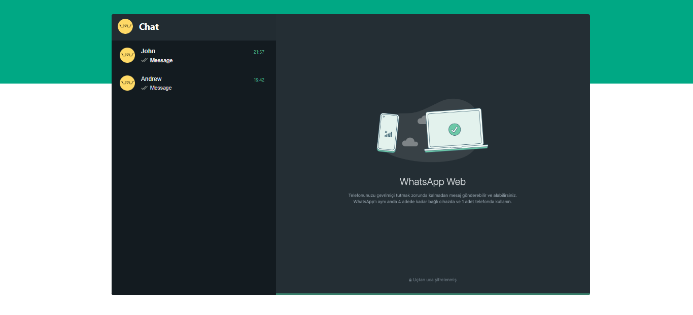

# WhatsAppClone

WhatsApp Clone Project

# [Figma's link](https://www.figma.com/file/hO7pxwWNs8dS7eNDtNy6Mu/Whatsapp-Web-Clone?type=design&node-id=0-1&mode=design)

- Figma was used for domain abstraction in this project, being useful in the analysis and projection of UI composition.

# Infrastructure

- NodeJS Backend
- Angular Frontend
- Database (MySQL)

# Autors

- @ayusuke7
- @eiandressacs
- @nikawaii57
